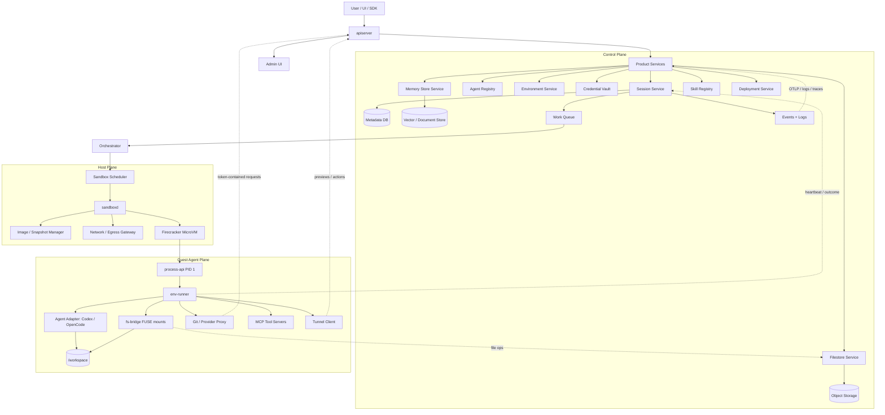
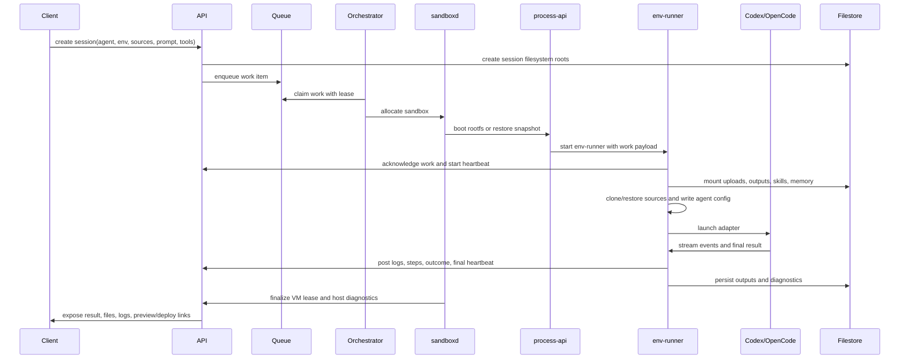

# Open Managed Agents Architecture

Status: draft target architecture, June 2026.

This document defines the first architecture target for this repository: an
open-source managed agents platform built around Codex, OpenCode, and future
agent adapters. It is informed by the Anthropic Managed Agents investigation
corpus, but it is a product design for this project rather than a claim that
Anthropic implements every component exactly this way.

## Product Goal

Build a local-first, open managed agents control plane that can run coding
agents in disposable isolated environments, persist their session data, and give
users one place to manage:

- agents;
- sessions;
- deployments;
- credential vaults;
- environments;
- memory stores;
- skills;
- files.

The important product promise is not only "run an agent in a VM." The platform
must make every long-running agent session inspectable, recoverable,
permissioned, and reproducible enough that humans can safely delegate real
software work.

## Evidence From The Anthropic Investigation

The reference corpus suggests a layered architecture:

- `environment-manager` is a product-layer runner that parses work payloads,
  prepares sources, configures auth, registers MCP servers, launches the code
  agent, records activity, manages tunnel actions, and reports outcomes.
- `process_api` is a small guest-side PID 1 and process-control API for
  Firecracker-style sandboxes. The June 2026 binary exposes process create,
  attach, stream, signal, timeout, OOM, trace, zstd, mount-root, fs-freeze,
  fs-thaw, auth key, status, and shutdown surfaces.
- Session files are mounted through a filestore-backed FUSE layer. Observed
  mounts include read-only uploads, read-write outputs, and read-only skills.
- Work delivery is lease-oriented: register worker, poll for work, acknowledge
  work, heartbeat, stop expired work, post events, and flush diagnostic logs.
- Credentials are normalized into a session auth context. Provider tokens are
  contained behind session-scoped ingress/proxy paths instead of being handed
  directly to arbitrary guest processes.
- Source setup is a first-class subsystem: git clone/fetch, sparse checkout,
  branch setup, project snapshot restore, seed bundle import, post-clone hooks,
  and git proxy setup.
- MCP servers are registered during startup as local HTTP servers with bearer
  tokens and per-tool policy, then merged into the agent config.
- Tunnel support is more than port forwarding. It includes proxied HTTP,
  WebSocket, cancellation, and named actions such as deploy, status, source
  download, and snapshot.
- Observability is product behavior: session events, step progress, diagnostic
  log buffering, OTLP endpoints, metrics, and local health files are part of
  the runtime contract.

The local summary of those conclusions is
[Anthropic Managed Agents Evidence Summary](../references/anthropic-managed-agents-evidence.md).
The upstream reference corpus files used for that summary were:

- `docs/design-docs/open-managed-agents-architecture.md`
- `docs/references/environment-manager-directory-map.md`
- `docs/references/environment-manager-auth-session-ingress-notes.md`
- `docs/references/environment-manager-orchestrator-lease-notes.md`
- `docs/references/environment-manager-source-init-notes.md`
- `docs/references/environment-manager-source-git-proxy-notes.md`
- `docs/references/environment-manager-sandbox-runtime-notes.md`
- `docs/references/environment-manager-mcp-server-map.md`
- `docs/references/environment-manager-tunnel-deploy-notes.md`
- `docs/references/environment-manager-session-activity-runtime-notes.md`
- `docs/references/environment-manager-observability-diag-notes.md`
- `docs/references/rclone-filestore-reverse-notes.md`
- `docs/references/process-api-current-wire-notes.md`
- `docs/references/managed-agent-cloud-runtime-inventory-2026-06-18.md`

## Layered System Model

### Layer Responsibilities

| Layer | Owns | Must not own |
| --- | --- | --- |
| Product UI/API | User-facing objects, authz decisions, audit trails, API contracts. | VM lifecycle details or agent-specific CLI quirks. |
| Control plane | Sessions, queues, leases, files, credentials, memory, skills, deployment state, event ingestion. | Arbitrary guest command execution. |
| Host plane | Firecracker lifecycle, jailer config, disks, snapshots, tap/vsock, cgroups, egress gateway, resource enforcement. | Product state beyond short-lived leases and local diagnostics. |
| Guest plane | Workspace bootstrap, source setup, tool config, code-agent launch, heartbeat, artifact collection. | Durable database writes or raw provider OAuth custody. |
| Agent adapter | Translate a session run into Codex/OpenCode argv, env, config, stream parsing, and result shape. | Platform scheduling, storage, or credential policy. |

## Product Object Model

These are the objects the simple management UI and API should expose from the
beginning, even if early implementations are local and minimal.

| Object | Purpose | Key fields | Relationships |
| --- | --- | --- | --- |
| Organization | Administrative trust boundary. | name, plan, policy defaults, retention, allowed providers. | Owns users, projects, vaults, hosts, and audit events. |
| User | Human or service actor. | identity, role, auth provider, status, last activity. | Creates sessions, manages objects, appears in audit events. |
| Project | Product/workspace boundary. | name, repo defaults, environments, retention, policy overrides. | Groups agents, sessions, files, skills, memory, and deployments. |
| Agent | A runnable agent profile. | name, adapter type, model/provider, default tools, prompt policy, resource profile, version. | Used by sessions; may reference skills, envs, and credential scopes. |
| Work item | Queueable execution request. | type, payload ref, priority, lease id, attempt count, idempotency key. | Claimed by orchestrator; creates run attempts for sessions or maintenance. |
| Session | One delegated unit of work. | status, prompt/task, source refs, current run, lease, logs, events, outputs, cost/usage, timeout. | Belongs to a project, agent, and environment; owns files, events, attempts, tunnels. |
| Run attempt | One execution of a session on a sandbox. | worker id, host id, VM id, image digest, start/end, exit reason, heartbeat, diagnostics. | Belongs to a session; produces events and artifacts. |
| Lease | Time-bounded ownership claim. | holder, resource type, expires at, heartbeat at, epoch, finalizer status. | Attached to work items, run attempts, VMs, tunnels, and deployment jobs. |
| Environment | A declared runtime profile. | base image/rootfs, CPU/memory/disk, language/toolset, init scripts, egress policy, sandbox policy. | Used by sessions and deployments; may be backed by Firecracker locally. |
| Deployment | A promoted artifact or preview. | provider, source session, artifact ref, URL, status, logs, rollback pointer. | Created by tunnel actions or control-plane deploy jobs. |
| Credential vault | Namespaced secret storage and release policy. | secret metadata, scopes, rotation state, last access, broker/proxy policy. | Owns secrets and release policies for projects and sessions. |
| Secret binding | Scoped secret grant. | secret id, target object, allowed use, release mode, expiry, audit id. | Allows a session, tool, proxy, or deployment job to request credentials. |
| File system | Path-addressed file namespace. | filesystem id, owner, mount roots, retention, quota, backend. | Exposed through filestore API and mounted into guests. |
| File/artifact | Persisted file object. | path, kind, size, media type, ttl, quarantine state, checksum, provenance. | Lives inside a filesystem; can be an upload, output, snapshot, skill file, or deployment artifact. |
| Memory store | Reusable knowledge for agents. | namespace, documents, embeddings/index metadata, retention, access policy. | Mounted or served to sessions through a memory adapter or MCP server. |
| Skill | Versioned agent capability package. | name, version, files, manifests, tool requirements, compatibility, trust level. | Mounted read-only into sessions and referenced by agent profiles. |
| Tool/MCP server | A callable capability. | transport, command/url, allowed tools, permission policy, auth mode. | Registered per session; may be built-in or user supplied. |
| Tunnel | Session-scoped reverse connection. | route id, target, protocol, action names, status, lease, last ping. | Exposes previews, WebSockets, cancellation, status, snapshots, and deploy actions. |
| Host | A machine capable of running sandboxes. | capacity, labels, health, supported isolation, current leases. | Runs VMs for sessions. |
| Sandbox image | A bootable guest image or snapshot. | digest, kernel/rootfs, tool inventory, build provenance, security posture. | Used by environments and run attempts. |
| Event | Structured product/runtime record. | type, actor, object, payload, timestamp, correlation id. | Drives UI timelines, logs, metrics, audit, and diagnostics. |
| Audit event | Durable security/product record. | actor, object, action, decision, timestamp, request id. | Attached to all mutating API actions and credential access. |

## Session State Model

The UI and API should reflect real lifecycle semantics instead of a vague
running/failed flag.

Initial states:

- `created`: session record exists, no work item is ready.
- `queued`: work item exists and is waiting for an orchestrator claim.
- `assigned`: orchestrator claimed work and selected a host.
- `booting`: host is preparing or restoring the sandbox.
- `initializing`: runner acknowledged work and is setting up mounts, sources,
  tools, credentials, and environment.
- `running`: code agent is executing the task.
- `heartbeat_lost`: lease is still recoverable, but expected heartbeat is late.
- `cancelling`: user or policy requested cancellation.
- `finalizing`: runner or reconciler is collecting outputs and diagnostics.
- `succeeded`: terminal success with outcome and artifacts recorded.
- `failed`: terminal failure with class and user-visible reason.
- `timed_out`: terminal timeout.
- `cancelled`: terminal user or policy cancellation.
- `archived`: hidden from active operational views but retained by policy.

## Core Runtime Contracts

The platform should stabilize contracts before overbuilding product features.

| Contract | Producer | Consumer | Why it matters |
| --- | --- | --- | --- |
| Session work payload | API / orchestrator | `env-runner` | Defines prompt, sources, env, tools, credentials, cwd, output schema, and timeouts. |
| Process protocol | `sandboxd` / orchestrator | `process-api` | Lets the host create, attach, stream, signal, inspect, freeze, thaw, and shut down guest processes. |
| Lease and heartbeat | `sandboxd` and `env-runner` | session service | Prevents orphaned VMs, stale sessions, double execution, and silent hangs. |
| Auth and secret envelope | vault / API | runner, proxies, MCP servers | Keeps durable secrets out of arbitrary guest processes and records each release decision. |
| Agent adapter API | `env-runner` | Codex/OpenCode adapters | Keeps the platform agent-agnostic. |
| Filestore API | guest `fs-bridge`, UI, SDK | filestore service | Makes uploads, outputs, skills, memory, and snapshots portable across sandboxes. |
| Vault release API | `env-runner`, MCP servers, proxies | vault service | Converts long-lived secrets into session-scoped, auditable credentials. |
| Source API | `env-runner` | git proxy / source manager | Keeps clone, sparse checkout, branch setup, and provider auth explicit. |
| MCP registration | session service / runner | code agent | Makes tools permissioned and observable rather than ad hoc config files. |
| Tunnel protocol | guest tunnel client | tunnel router | Supports previews, WebSockets, deploy/status/snapshot actions, and cancellation. |
| Event model | runner, host, API | UI and observability | Powers progress UI, debugging, billing/cost, audit, and incident review. |

## Session Lifecycle

## Component Plan

The first deployable shape is deliberately small: `apiserver`, `orchestrator`,
and `sandboxd` are the only long-running platform services required for the
MVP. The remaining product capabilities below start as modules inside
`apiserver` unless a later load, scaling, security, or ownership boundary proves
they need their own process.

### Control Plane

- `apiserver`: UI, public API, authn/authz, OpenAPI or ConnectRPC contracts,
  object CRUD, session creation, event read APIs, admin operations, filestore,
  vault, skill registry, memory metadata, deployment records, and event ingest.
- Do not name this service `web-api`; the API server owns the product
  control-plane surface, not only browser-facing endpoints.
- `session module`: session state machine, run attempts, leases, queue
  integration, retries, timeouts, finalizers, and result normalization. It starts
  inside `apiserver`; split only if load or ownership demands it.
- `orchestrator`: claims work, assigns hosts, enforces policy, watches
  heartbeat expiry, and reconciles stuck sessions.
- `agent registry module`: agent profiles, adapter metadata, model/provider
  config, prompt/tool policy, and versioning.
- `environment module`: environment templates, resource profiles, image
  selection, init scripts, package inventories, and sandbox policy.
- `vault module`: encrypted secret metadata, scoped release tokens, proxy
  credentials, rotation metadata, and audit events.
- `filestore module`: path-addressed filesystems backed by S3-compatible object
  storage, plus import/export, range reads, metadata, TTL, and quarantine.
- `memory module`: namespace management, documents, embedding/index metadata,
  retention, and session access policy.
- `skill registry module`: versioned skill packages, validation, compatibility,
  trust/approval metadata, and read-only session mounts.
- `deployment module`: previews and deploy records, provider integrations,
  artifact tracking, logs, and rollback metadata.
- `event module`: structured session events, diagnostics, logs, metrics, and
  later traces.

MVP deployment keeps the control plane simple: `apiserver` owns every product
module except scheduling/reconciliation, which belongs to `orchestrator`.
`filestore`, `vault`, `events`, `skills`, `memory`, and `deployments` are not
separate deployed services in the first cut.

### Host Plane

- `sandboxd`: supervises Firecracker and jailer, prepares block devices,
  network, vsock, cgroups, and local diagnostics.
- Treat `sandboxd` as the host-side agent by responsibility, but keep the
  process name explicit. `host-agent` is a role description, not a service name.
- `image-manager`: builds, imports, verifies, caches, and garbage-collects
  kernels, rootfs images, and snapshots.
- `network-gateway`: enforces egress policy, records domains/targets, and
  blocks metadata-service or private-network access unless explicitly allowed.
- `resource-monitor`: emits host and VM metrics, OOM/timeout signals, and
  capacity information to the control plane.

### Guest Plane

- `process-api`: minimal PID 1 and process protocol. Keep it generic and small.
- `env-runner`: product runner for work payload parsing, source setup, mounts,
  MCP registration, agent launch, heartbeat, event reporting, and cleanup.
- `agent-adapters`: Codex first or OpenCode first, then the other once the
  adapter contract is stable. Adapters own config writing and stream parsing.
- `fs-bridge`: FUSE layer for `/mnt/session/uploads`, `/mnt/session/outputs`,
  `/mnt/skills`, and later `/mnt/memory`.
- `git-proxy`: session-scoped source and provider access without putting
  durable provider tokens directly in the VM.
- `mcp-runtime`: built-in local MCP servers and user-provided MCP registration
  with bearer tokens and explicit tool policy.
- `tunnel-client`: previews, WebSocket forwarding, cancellation, status,
  source download, snapshots, and deploy actions.

## MVP Cut

The MVP should prove one complete session loop before broadening the product.

Build first:

- local single-node control plane;
- SQLite or Postgres metadata store;
- MinIO or local S3-compatible object storage;
- one host machine;
- one Firecracker VM per session;
- `apiserver`, `orchestrator`, `sandboxd`, `process-api`, and `env-runner`;
- one agent adapter, preferably Codex if this repo optimizes for Codex first;
- basic source clone for public and token-proxied GitHub repos;
- read-only uploads and skills mounts, read-write outputs mount;
- heartbeat, hard timeout, cancellation, and finalizer;
- structured session logs, steps, and diagnostics;
- minimal UI pages for agents, sessions, files/artifacts, environment config,
  vault bindings, logs, and run details.

Add next:

- second agent adapter, likely OpenCode;
- memory stores mounted or exposed through MCP;
- deployment records and one deploy provider;
- snapshot restore for faster startup;
- richer tunnel actions;
- multi-host scheduling;
- agent/profile versioning and approval workflow;
- SBOM/provenance for sandbox images and skills.

Defer:

- marketplace-scale skill discovery;
- complex bin-packing;
- BYOC/customer-managed environments;
- live collaborative editing;
- automatic long-term memory writes;
- advanced credential rotation UX;
- rich collaboration/session replay;
- multi-region control plane;
- full billing and quota system.

## UI Information Architecture

The first UI should be an operational console, not a landing page.

Primary navigation:

- Sessions: queue, running, completed, failed, logs, files, previews, run
  attempts, diagnostics, and cancellation.
- Agents: profiles, adapter type, model/provider, tools, default environment,
  skills, and prompt policy.
- Environments: image, resources, init scripts, egress/sandbox policy, tool
  inventory, and recent run health.
- Vault: secrets, scopes, release policies, rotations, last access, and audit.
- Files: session filesystems, uploads, outputs, snapshots, imports, downloads,
  TTL, and quarantine state.
- Skills: packages, versions, manifests, trust state, compatibility, and mount
  paths.
- Memory: namespaces, documents, indexes, retention, and access policy.
- Deployments: provider, source session, status, URL, logs, artifact, rollback.
- Hosts: capacity, health, active VMs, image cache, failures, and diagnostics.

The highest-value first screen is the Sessions list with live status and recent
failures. It should make failed initialization, credential denial, source clone
failure, timeout, and agent exit reasons obvious without opening raw logs first.

## Design Pressure Tests

These are the questions the plan must keep passing as implementation details
change.

| Question | Required answer |
| --- | --- |
| Can a session be explained after it fails? | Yes: events, steps, logs, exit reason, run attempt, host, image digest, files, and credential denials are linked. |
| Can a durable secret leak into a guest workspace? | It should not by design. Guests receive session-scoped proxy credentials or short-lived material, with audit. |
| Can Codex be replaced by OpenCode? | Yes: product state and runner logic depend on an adapter contract, not Codex-specific files. |
| Can storage survive VM loss? | Yes: important inputs/outputs live in filestore/object storage; workspace disk is disposable. |
| Can an orphaned VM keep running forever? | No: host and runner heartbeats, leases, hard timeouts, and finalizers reconcile state. |
| Can a user inspect or revoke tool power? | Yes: tools/MCP servers have explicit session registration and permission policy. |
| Can a compromised session pivot freely? | It should be constrained by VM isolation, egress policy, scoped credentials, filesystem mounts, and audit. |
| Can we start without Firecracker? | Yes for local development only, if the process and runner contracts stay compatible with Firecracker. |

## Architectural Decisions

- Keep `process-api` generic. Product logic belongs in `env-runner` and control
  plane services.
- Keep `sandboxd` separate from `orchestrator`. `orchestrator` owns scheduling,
  leases, retries, timeout, cancellation, and reconciliation; `sandboxd` owns
  local Firecracker, jailer, disk, network, process-api connection, VM
  monitoring, and cleanup.
- Treat Firecracker as the production isolation target, but keep a local
  non-Firecracker runner for developer iteration.
- Keep session files durable and path-addressed. The VM workspace is cache and
  scratch space, not the source of truth.
- Make leases a first-class data model rather than an implementation detail of
  a queue library.
- Release credentials through a vault/proxy boundary. Do not make environment
  variables the primary secret transport for durable provider tokens.
- Use MCP as a session tool registration mechanism, not as the only internal
  service boundary.
- Build the UI around operational diagnosis first. Management CRUD is useful
  only if users can understand what an agent did and why it failed.
- Prefer small open protocols and generated clients for control-plane to guest
  contracts.

## Rejected Shortcuts

- Do not model the product as only "agent runs in a container." The production
  target is a Firecracker-style VM boundary with explicit guest process control.
- Do not collapse `process-api` and `env-runner`. A small generic process API
  keeps VM control separate from product behavior.
- Do not collapse `orchestrator` and `sandboxd`. Doing so would mix global
  scheduling/state-machine logic with high-privilege host-local Firecracker
  operations.
- Do not let agents talk directly to product databases, durable vault secrets,
  or provider OAuth tokens.
- Do not treat filestore as a plain S3 bucket mounted in the VM. The product
  needs a path-addressed session filesystem API with UI, policy, TTL,
  quarantine, and artifact semantics.
- Do not make a marketplace-scale MCP abstraction the first tool system. Start
  with explicit per-session registration, bearer auth, tool policy, and config
  merge.
- Do not build broad UI CRUD before lifecycle semantics are real. The UI must
  reflect actual queued, assigned, booting, initializing, running,
  heartbeat-lost, finalizing, failed, timed-out, cancelled, succeeded, and
  archived states.

## Open Questions

- Which adapter should be first: Codex for alignment with this repo, or OpenCode
  for easier fully open demonstrations?
- Should the first metadata store be SQLite for local install simplicity or
  Postgres to avoid early migration churn?
- Do we implement `fs-bridge` directly with go-fuse first, or start with an
  rclone-compatible backend?
- Should memory stores be ordinary filestore-backed documents first, or a
  separate vector/document service from day one?
- What is the minimum credential broker that demonstrates safety without
  building a full vault product too early?
- Which deploy provider gives the best open-source demo without tying the core
  architecture to a proprietary workflow?
